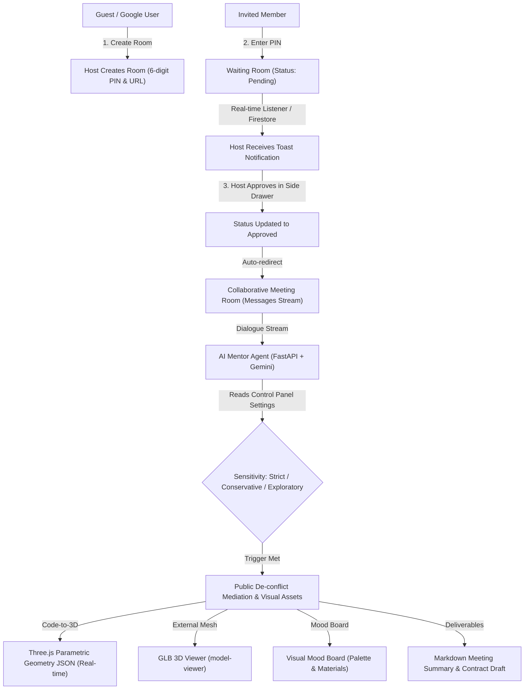

# AI Mentor Collaboration Platform

> **Positioning**: A group conversational intermediary platform fusing the Google AI ecosystem with Group Conversational Agent (GCA) theory. Designed for remote collaborative design and client decision-making, the platform positions AI as a background mediator and visual asset generator that intervenes constructively whenever cognitive gaps or discourse stagnation arise.

---

## System Architecture & Interaction Flow



---

## Core Specifications & Features

### 1. Authentication & Host Approval Flow
* **Progressive Onboarding**:
  * **Guest Mode (Default)**: Enter nickname and select an avatar to participate immediately. Stores anonymous UID in `localStorage` with clear indicators regarding local persistence.
  * **Google Account Upgrade**: One-click upgrade with Firebase Authentication, unlocking the cross-device **Project Dashboard** and historical AI assets.
* **Waiting Room & Host Approval**:
  * First creator automatically becomes **Host**, receiving a 6-digit PIN and sharable URL.
  * Invited participants entering via PIN/URL join a **Waiting Room** displaying an animated pulse indicator ("Waiting for Host Approval...").
  * Hosts receive real-time **Toast Notifications** and can review applicants via the **Control Drawer** ("Pending" vs. "Approved" lists) with instant Allow/Reject actions.
  * Upon approval, invited members are automatically redirected into the collaborative session and synced with chat history.

### 2. Group Interaction & Tension Control (GCA Mediation)
* **Proactivity vs. Group Autonomy (Mentor Control Panel)**:
  * `Strict`: Intervenes only when explicitly addressed with `@Mentor`.
  * `Conservative` (Default): Intervenes upon detecting 3 consecutive divergent viewpoints, prolonged discussion stagnation, or explicit visual/spatial demands.
  * `Exploratory`: Proactively provides variant proposals and reference assets.
  * **Module Toggles**: Individual on/off switches for 3D Prototypes, Mood Boards, Fact Retrieval, and Process Deliverables.
* **Visibility & Friction Reduction**:
  * All AI contributions remain strictly **public to all members**.
  * System prompt enforces objective, asset-oriented, neutral phrasing (e.g., *"To facilitate conceptual visualization, here is a reference:"*), eliminating evaluative interpersonal language.

### 3. Core Capabilities & Dual-Track 3D Engine
* **Dual-Track 3D Prototype Engine**:
  * `Code-to-3D`: Gemini generates clean Three.js geometry JSON (primitives, dimensions, PBR materials, annotations). Rendered client-side with zero latency and interactive orbit/wireframe controls.
  * `External Mesh API`: High-fidelity organic GLB asset pipeline rendered via `<model-viewer>` with 360° inspection and shadow simulation.
* **Visual Mood Board**: Extracts abstract aesthetic keywords and compiles color swatches with one-click HEX copying, material callouts, and curated visual slices.
* **Structured Deliverables**: Automatically compiles Markdown meeting minutes and technical contract drafts based on JSON schemas, complete with modal preview and one-click `.md` download.

### 4. Firestore Security Rules Architecture (`firestore.rules`)
* `/rooms/{roomId}/participants/{uid}`: Anyone authenticated may create a `status: "pending"` application document. Only `hostUid` can update status to `approved` or `rejected`.
* `/rooms/{roomId}/messages/{messageId}`: Strict read/write restrictions: Only participants whose status is `approved` can read chat history and dispatch new messages.

---

## Project Structure

```text
ai-mentor-platform/
├── .gemini/
│   └── rules.md             # Antigravity AI team collaboration rules
├── .gitignore               # Excludes secrets, node_modules, and cache
├── .env.example             # Environment variables template
├── README.md                # Project documentation and guide
├── firestore.rules          # Firestore database security rules
├── backend/                 # Google Cloud Run + FastAPI service
│   ├── main.py              # API routes & room lifecycle
│   ├── config.py            # Environment settings
│   ├── Dockerfile           # Cloud Run deployment container
│   ├── requirements.txt     # Python dependencies (FastAPI, google-genai)
│   ├── models/schemas.py    # Pydantic data schemas
│   └── services/
│       ├── mentor_agent.py  # GCA mediation engine (sensitivity logic)
│       └── tools_engine.py  # 3D JSON, GLB, moodboard, and doc tools
└── frontend/                # Vue 3 + TypeScript + Tailwind CSS
    ├── package.json         # Three.js, model-viewer, Pinia, Lucide
    ├── vite.config.ts       # Custom element compiler setup
    ├── index.html
    └── src/
        ├── stores/          # Pinia stores (auth, room, mentor)
        ├── router/          # Vue Router configurations
        ├── components/      # 3D viewers, moodboard, drawer, toasts
        └── views/           # Home, Waiting Room, Meeting Room, Dashboard
```

---

## Quick Start

### 1. Backend Service (FastAPI)

```powershell
cd backend
python -m venv .venv
.\.venv\Scripts\activate
pip install -r requirements.txt
python main.py
```
> The API server runs at `http://localhost:8000`. Interactive API documentation is available at `http://localhost:8000/docs`.

### 2. Frontend Application (Vue 3 + Vite)

```powershell
cd frontend
npm install
npm run dev
```
> The frontend client runs at `http://localhost:5173`.

---

## Team Git Workflow

1. **Pull Latest Changes**:
   ```powershell
   git pull origin main
   ```

2. **Create Feature Branch**:
   ```powershell
   git checkout -b feature/waiting-room-enhancements
   ```

3. **Commit & Push**:
   ```powershell
   git add .
   git commit -m "feat: improve host approval notifications"
   git push origin feature/waiting-room-enhancements
   ```

4. **Submit Pull Request**:
   Open a Pull Request on the GitHub Organization repository (`AIPoweredCollaborativeDesignPlatform/ai-mentor-platform`) for code review and automated checks.
